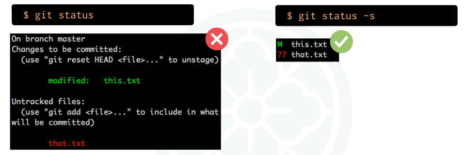
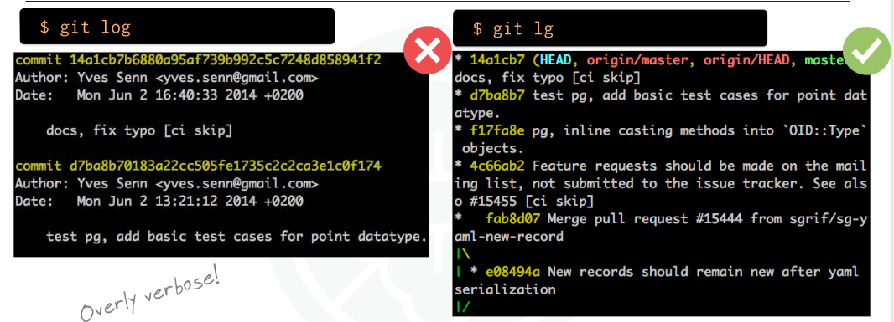

# Konfigurasi Git

Git memiliki fitur untuk menyimpan pengaturan (config) di beberapa level. Sehingga perilaku Git bisa disesuaikan untuk semua repo, repo tertentu, atau seluruh pengguna di satu mesin. Ada **tiga level konfigurasi**: `--system`, `--global`, dan `--local`.

## Level Konfigurasi Git

| Level      | Flag       | Berlaku untuk                      | Contoh                                          |
| :--------- | :--------- | :--------------------------------- | :---------------------------------------------- |
| **System** | `--system` | Semua pengguna di mesin tersebut   | `git config --system color.ui true`             |
| **Global** | `--global` | Pengguna saat ini (semua repo-nya) | `git config --global user.name "Nama Kamu"`     |
| **Local**  | `--local`  | Hanya untuk satu repo tertentu     | `git config --local user.email kamu@contoh.com` |

:::info[Catatan]
Sering dipakai **local email** jika Anda butuh email berbeda, untuk repo tertentu (contoh: akun GitHub personal vs kantor).  
:::

```bash title="git"
# Contoh set email khusus untuk repo saat ini
git config --local user.email kamu@contoh.com

# Contoh atur warna output untuk semua user di mesin (butuh akses admin)
git config --system color.ui true
```

## Mengecek & Menyetel Konfigurasi Global

### Cek identitas global :

```bash title="git"
git config --global user.name
git config --global user.email
```

Contoh output di materi: **Bill** dan **bill@deadly-vipers.com**.

### Set identitas global :

```bash title="git"
git config --global user.name "Beatrix Kiddo"
git config --global user.email "beatrix@deadly-vipers.com"
```

Setelah itu, Git akan menempelkan nama & email ini pada setiap commit dari user tersebut.

---

## Melihat Isi File Konfigurasi

### Daftar semua config global :

```bash title="git"
git config --global --list
```

**Output :**

```bash title="output git"
contoh (dari materi):
user.name=Beatrix Kiddo
user.email=beatrix@deadly-vipers.com
core.autocrlf=input
color.ui=true
```

### Lihat file `~/.gitconfig` :

```bash
cat ~/.gitconfig
```

**Output**

```git title="output git"
[user]
  name = Beatrix Kiddo
  email = beatrix@deadly-vipers.com
[core]
  autocrlf = input
[color]
  ui = true
```

:::warning[Penting]
File di atas **boleh diedit manual** pakai editor teks. Namun, harus hati-hati karena suatu kesalahan bisa menyebabkan git error.
:::

## Melihat Konfigurasi Lokal (per repo)

### Jalankan perintah ini di dalam folder repo Git:

```bash
git config --local --list
```

```bash title="output git"
contoh (dari materi):
user.name=Beatrix Kiddo
core.repositoryformatversion=0
core.filemode=true
core.bare=false
core.logallrefupdates=true
core.ignorecase=true
core.precomposeunicode=false
```

Anda juga bisa melihat file `.git/config`:

```bash
cat .git/config
```

```bash title="output git"
[user]
  name = Beatrix Kiddo
[core]
  repositoryformatversion = 0
  filemode = true
  bare = false
  logallrefupdates = true
  ignorecase = true
  precomposeunicode = false
```

Sama seperti global, file di atas juga **bisa diedit manual**, namun hanya berlaku untuk repo tersebut. **Dan yang terpenting harus hati-hati**

---

## 5 Line Endings (CRLF vs LF)

**Agar baris akhir (line endings) konsisten lintas OS:**

- **Linux/Mac (pakai LF) :**

  ```bash title="bash"
  git config --global core.autocrlf input
  ```

  Mode `input` akan **menghapus CR** saat menyimpan ke repo (menjadi LF).

- **Windows (pakai CRLF) :**

  ```bash title="bash"
  git config --global core.autocrlf true
  ```

  Mode `true`**menambah CR kembali saat checkout** ke _working directory_, sehingga nyaman untuk editor Windows yang mengharuskan CRLF.

Intinya: **keduanya** mencegah CRLF “bocor” ke repo, tetapi **Windows** akan mengembalikan CR saat file di-_checkout_.

---

## Perilaku Default git push

```bash title="perintah git"
git config --global push.default simple
```

- **simple :** Hanya mendorong **branch saat ini** ke remote dengan nama yang sama. Ini **default sejak Git 2.0** dan paling aman untuk pemula.

- **matching :** Mendorong **semua branch** yang namanya cocok antara lokal dan remote.

## Perilaku Default git pull (merge vs rebase)

**Secara konsep :**

- `git pull` = `git fetch` + `merge`

- `git pull --rebase` = `git fetch` + `rebase`

Untuk menghindari “_useless merge_” (commit merge kecil-kecil), banyak tim memilih default **rebase** agar riwayat lebih rapi:

```bash title="perintah git"
git config --global pull.rebase true
```

Dengan ini, _branch baru_ akan _fetch lalu rebase_ saat di-_pull_.

## Mengaktifkan Reuse Recorded Resolution (ReReRe)

**`ReRere`** membuat Git **mengingat** bagaimana Anda menyelesaikan konflik merge sebelumnya, dan **mengulanginya otomatis** jika konflik serupa muncul lagi (sangat membantu saat sering _cherry-pick_ atau _rebase_ berulang):

```bash tite="perintah git"
git config --global rerere.enabled true
```

## Warna Output

```bash title="perintah git"
git config --global color.ui true
```

Mewarnai output (status, diff, log) agar mudah dibaca. Catatan: ini sudah menjadi default sejak Git 1.8.4, jadi hanya perlu diatur manual pada versi lebih lama.

## Alias yang Berguna

Agar anda mengetik perintah menjadi lebih singkat dan informatif:





```bash title="perintah git"
# 'git s' = status ringkas
git config --global alias.s "status -s"

# 'git lg' = log ringkas + dekorasi + semua branch + graph
git config --global alias.lg "log --oneline --decorate --all --graph"
```

- **`git s` :** lebih ringkas daripada `git status` biasa.

- **`git lg` :** memberi tampilan riwayat yang padat dan mudah diikuti.

## Berbagi Konfigurasi (Opsional)

Dua cara ringan untuk berbagi _dotfiles_ dan pengaturan tim:

- **Wiki :** proyek (menulis panduan config tim).

- **Repo dotfiles :** (menyimpan `~/.gitconfig`, skrip, dan template).

Jika Anda butuh **panduan yang mudah dibaca, visual, dan tidak terlalu teknis**, gunakan **Wiki**.

Jika Anda butuh **otomatisasi, konsistensi, dan versi kontrol** untuk file konfigurasi, gunakan **Repositori Git** yang berisi `dotfiles` dan skrip.

### Menggunakan Wiki Proyek

Pendekatan ini menggunakan **Wiki** (seperti yang ada di GitHub, GitLab, atau platform lain) sebagai tempat untuk membuat dokumentasi atau panduan. Tim akan menulis langkah-langkah, instruksi, dan contoh konfigurasi di sana.

**Kelebihan:**

- **Mudah Dibaca :** Wiki sangat cocok untuk penjelasan naratif. Anda bisa menambahkan gambar, video, dan penjelasan yang panjang.

- **Tidak Rumit :** Ini tidak melibatkan kode atau skrip yang harus dijalankan. Cukup ikuti panduan manual.

- **Fleksibel :** Cocok untuk panduan yang lebih dari sekadar file konfigurasi, seperti "cara mengatur _virtual environment_," "instalasi _dependencies_," atau "bagaimana menjalankan _test suite_."

**Contoh Langkah-langkah Penerapan:**

1.  **Buat Halaman Wiki Baru :** Di halaman Wiki proyek Anda, buat halaman baru berjudul, misalnya, "Panduan Pengaturan Lingkungan Tim."

2.  **Tulis Panduan :**

    - Sebutkan _software_ yang diperlukan (misalnya, Node.js versi 18, Python versi 3.10).

    - Sertakan contoh `dotfiles` yang umum, seperti `~/.gitconfig` atau `.editorconfig`.

    - Tuliskan perintah-perintah yang perlu dijalankan.

    - Tambahkan _screenshot_ atau video jika perlu untuk mempermudah.

Ini adalah cara yang bagus jika tim Anda lebih suka panduan yang eksplisit dan berbasis teks.

---

### Menggunakan Repo Dotfiles

Pendekatan ini lebih teknis. Tim akan membuat **repositori Git terpisah** yang hanya berisi `dotfiles` dan skrip yang diperlukan. Semua anggota tim kemudian akan mengklon (_clone_) repositori ini dan menjalankannya untuk secara otomatis menyalin semua konfigurasi ke komputer mereka.

**Kelebihan:**

- **Otomatisasi:** Ini adalah cara yang paling efisien. Setelah diatur, anggota tim bisa mendapatkan semua konfigurasi yang sama hanya dengan beberapa perintah.

- **Versi Kontrol:** Karena ini adalah repositori Git, Anda bisa melacak perubahan, melihat riwayat (`git log`), dan kembali ke versi konfigurasi sebelumnya.

- **Konsistensi:** Memastikan setiap anggota tim menggunakan konfigurasi yang sama persis, yang bisa mencegah bug atau masalah yang hanya muncul di satu komputer.

**Contoh Langkah-langkah Penerapan:**

1.  **Buat Repositori Baru:** Buat repositori Git kosong di GitHub, misalnya, `tim-dotfiles`.

2.  **Tambahkan `Dotfiles` Anda:**

    - Di komputer Anda, salin _file_ konfigurasi penting (seperti `.gitconfig`, `.zshrc`, atau `.bash_profile`) ke dalam repositori baru ini.

    - Tambahkan skrip otomatisasi. Skrip ini bisa berupa `install.sh` yang akan menyalin semua file ke lokasi yang benar (`~`) di komputer anggota tim lain.

3.  **Contoh Skrip Otomatisasi (Opsional tapi Direkomendasikan):**
    Anda bisa membuat _file_ `install.sh` di dalam repositori Anda. Berikut adalah contoh sederhana:

    ```bash
    #!/bin/bash

    # Direktori tempat repositori diklon
    DOTFILES_DIR=$(pwd)

    # Direktori home user
    HOME_DIR=~

    # Salin .gitconfig ke direktori home
    echo "Menyalin .gitconfig..."
    cp "$DOTFILES_DIR/.gitconfig" "$HOME_DIR/.gitconfig"

    # Salin .zshrc ke direktori home
    echo "Menyalin .zshrc..."
    cp "$DOTFILES_DIR/.zshrc" "$HOME_DIR/.zshrc"

    echo "Selesai! Konfigurasi tim telah diterapkan."
    ```

    Skrip ini akan menyalin file dari repositori ke lokasi `~`.

4.  **Berbagi dengan Tim:**

    - Anggota tim lain cukup mengklon repositori ini: `git clone https://github.com/nama-tim/tim-dotfiles.git`
    - Kemudian mereka menjalankan skrip instalasi: `cd tim-dotfiles && ./install.sh`

## Setting tambahan (Opsional)

### Menentukan Editor Default Git (VSCode)

```bash title="perintah git"
git config --global core.editor "code --wait"
```

Git sering memerlukan editor teks, misalnya:

- saat menulis pesan commit panjang (tanpa `-m`)
- saat melakukan `git rebase -i`
- atau saat merge membutuhkan pesan.

Perintah di atas menyetel **Visual Studio Code** sebagai editor default Git.

Flag `--wait` penting, karena Git harus **menunggu** sampai editor ditutup sebelum melanjutkan proses.

Kalau tidak di-set, Git biasanya pakai editor default sistem (`nano`, `vim`, dsb). Jadi ini **berguna** kalau Anda lebih nyaman pakai VS Code.

### Menentukan Diff Tool

```bash title="perintah git"
git config --global diff.tool "default-difftool"

```

- Git punya fitur `git difftool`, mirip `git diff`, tapi bisa membuka perbedaan file dengan aplikasi eksternal.

- Baris ini mendefinisikan **nama tool default** yang nanti dipakai.

### Menggunakan VS Code sebagai Diff Tool

```bash title="perintah git"
git config --global difftool.default-difftool.cmd "code --wait --diff $LOCAL $REMOTE"
```

- Baris ini menghubungkan nama `default-difftool` dengan perintah nyata, yaitu **membuka diff di VS Code**.

- `code --diff fileA fileB` adalah cara VS Code menampilkan perbandingan antar file.

## Rekomendasi Cepat (siap tempel)

```bash title="perintah git"
# Identitas global
git config --global user.name "Nama Kamu"
git config --global user.email "kamu@example.com"

# Warna & push default
git config --global color.ui true
git config --global push.default simple

# Pull default: rebase
git config --global pull.rebase true

# Line endings
# Linux/Mac:
git config --global core.autocrlf input
# Windows:
# git config --global core.autocrlf true

# Rerere untuk percepat resolve konflik berulang
git config --global rerere.enabled true

# Alias favorit
git config --global alias.s "status -s"
git config --global alias.lg "log --oneline --decorate --all --graph"

# Opsional
git config --global core.editor "code --wait"

git config --global diff.tool "default-difftool"
git config --global difftool.default-difftool.cmd "code --wait --diff $LOCAL $REMOTE"
```
