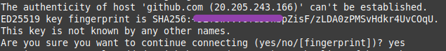

# Menghubungkan Git Lokal ke GitHub (Remote)

Setelah konfigurasi Git selesai, langkah penting berikutnya adalah **menghubungkan repo lokal** dengan **remote repo di GitHub**.
Ada dua cara utama: **SSH** dan **HTTPS (PAT)**.

## Opsi 1: Menghubungkan via SSH (Disarankan)

SSH lebih praktis karena tidak perlu memasukkan username/password setiap kali `git push`.
Kita membuat _key pair_ (private & public key) untuk autentikasi.

### Buat SSH key baru

```bash
ssh-keygen -t ed25519 -C "email@example.com"

```

- `ssh-keygen` → perintah untuk membuat SSH key.
- `-t ed25519` → algoritma modern & lebih aman daripada RSA.
- `-C "email@example.com"` → komentar agar mudah diidentifikasi di GitHub (biasanya pakai email akun GitHub atau email apapun yang anda miliki).

### Setelah dijalankan:

- Anda akan ditanya lokasi penyimpanan (default: `~/.ssh/id_ed25519`).

- Bisa isi passphrase (opsional, untuk keamanan ekstra).

**Tujuan: menghasilkan dua file :**

- `id_ed25519` → private key (jangan dibagikan).
- `id_ed25519.pub` → public key (boleh didaftarkan ke GitHub).

### Tambahkan key ke SSH agent (Jika mengisi passphrase)

```bash
eval "$(ssh-agent -s)"
ssh-add ~/.ssh/id_ed25519
```

- `ssh-agent` adalah proses yang menyimpan private key di memori.
- `eval "$(ssh-agent -s)"` → menjalankan ssh-agent di background.
- `ssh-add ~/.ssh/id_ed25519` → mendaftarkan private key ke ssh-agent.

**Tujuan: supaya Anda tidak perlu ketik passphrase setiap kali Git melakukan autentikasi.**

### Daftarkan public key ke GitHub

```bash
cat ~/.ssh/id_ed25519.pub
```

- Copy output-nya.

- Buka GitHub → **Settings → SSH and GPG keys → New SSH key** →Isi title = bebas, key type = authentication key, paste output pada kolom key → Save.

### Tes koneksi SSH

```bash
ssh -T git@github.com
```



Jika muncul option seperti di atas, pilih **yes.**

**Kalau berhasil akan muncul :**

```
Hi username! You've successfully authenticated, but GitHub does not provide shell access.
```

### Tambahkan remote dengan SSH

```bash
git remote add origin git@github.com:username/nama-repo.git
git push -u origin master
```

---

## Opsi 2: Menghubungkan via HTTPS (dengan Personal Access Token)

HTTPS bisa dipakai jika SSH diblokir oleh firewall atau di lingkungan tertentu.
Sejak Agustus 2021, GitHub **tidak menerima password lagi**, melainkan **Personal Access Token (PAT)**.

### Buat Personal Access Token

1. GitHub **→** **Settings → Developer settings → Personal access tokens**.

2. Pilih **Fine-grained token** (best practice terbaru).

3. Beri scope minimal: `repo` (untuk akses push/pull).

4. Copy token (hanya bisa dilihat sekali!).

### Tambahkan remote dengan HTTPS

```
git remote add origin https://github.com/username/nama-repo.git
```

### Push pertama kali

```
git push -u origin master
```

Git akan minta **username** & **password**:

- Username = username GitHub Anda

- Password = **PAT** (bukan password GitHub biasa).

### Gunakan Credential Manager (supaya tidak bolak-balik ketik token)

- **Linux / macOS**: Git sudah mendukung `git-credential-manager` atau `osxkeychain`.

  ```bash
  git config --global credential.helper store
  ```

  Kode di atas, untuk menyimpan username & PAT di `~/.git-credentials` (plaintext, cukup aman kalau laptop pribadi).

- **Untuk macOS lebih aman:**

  ```bash
  git config --global credential.helper osxkeychain
  ```

- **Windows**:

  - Instal [Git Credential Manager](https://github.com/GitCredentialManager/git-credential-manager).

  - Git akan menyimpan PAT di Windows Credential Manager.

## Best Practice Saat Ini

- **SSH** **→** pilihan utama (aman & nyaman, tidak perlu ketik ulang).
- **HTTPS + PAT + Credential Manager** **→** cadangan kalau SSH tidak bisa.
- Jangan pernah commit file berisi PAT atau private key.

## Tambahan : Tentang passphrase ssh

### 🔑 Apa itu passphrase di SSH key?

- Saat membuat key ( `ssh-keygen`), Git menanyakan passphrase.
- **Passphrase ≠ password GitHub**, tapi semacam kunci tambahan untuk melindungi **private key** Anda.
- Jadi, meski ada file private key ( `id_ed25519`), orang lain tetap tidak bisa pakai kalau tidak tahu passphrase-nya.
  ***

### 🤔 Kalau saya tidak isi passphrase?

- Private key Anda **tidak dilindungi password** → lebih praktis, karena Git bisa langsung pakai key tanpa prompt.
- Tapi risikonya: kalau ada orang lain dapat akses ke file `id_ed25519` (misalnya laptop dicuri atau diretas), mereka bisa langsung pakai untuk akses GitHub Anda.
  ***

### 🔄 Apakah ssh-agent masih diperlukan kalau tanpa passphrase?

- **Tidak wajib**.
  - Kalau key **tidak ada passphrase**, Git bisa langsung pakai private key dari `~/.ssh/` tanpa bantuan `ssh-agent`.
- **Tetap berguna**.
  - `ssh-agent` berfungsi sebagai _pengelola key_.
  - Kalau suatu saat Anda membuat key **dengan passphrase**, `ssh-agent` menyimpan unlock key di memori, jadi Anda tidak perlu ketik passphrase berulang kali.
  ***

### ✅ Best Practice

- Kalau laptop **hanya dipakai pribadi**, seringnya orang **tidak pakai passphrase** untuk kenyamanan.

- Kalau laptop **berisi data penting** atau dipakai di kantor, **sebaiknya pakai passphrase** dan jalankan `ssh-agent`.

Jadi, jika dalam kasus anda, tanpa menggunakan passphrase, perintah **`ssh-add` sebenarnya tidak perlu**. Git akan tetap bisa autentikasi dengan key di `~/.ssh/id_ed25519`.

Tapi menambahkan tetap **tidak ada ruginya**, karena kompatibel untuk ke depan kalau suatu saat Anda generate key baru dengan passphrase.
