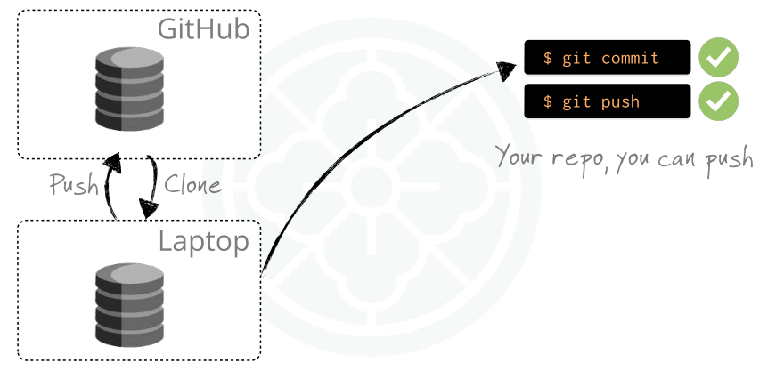

# Forking & Cloning

GitHub menyediakan dua cara utama untuk mendapatkan repo ke komputer lokal: **clone** langsung, atau **fork lalu clone**. Perbedaan keduanya terletak pada hak akses dan cara berkolaborasi.

## Membuat Repository Baru

### Alur umum:

1. Buat repo di GitHub (kosong atau dengan README).

2. Clone repo itu ke laptop Anda.

3. Lakukan commit → push.

```bash title="perintah git"
# Membuat repo lokal dari nol
git init nama_proyek
cd nama_proyek
git remote add origin https://github.com/username/nama_proyek.git
git add .
git commit -m "Inisialisasi proyek"
git push -u origin master
```



## Clone Repo Jika Anda Kolaborator

Kalau Anda ditambahkan sebagai **collaborator** di GitHub, maka Anda bisa langsung clone dan push:

```bash title="perintah git"
git clone https://github.com/org/proyek.git
cd proyek
# lakukan perubahan
git add .
git commit -m "Perubahan fitur"
git push origin master
```

Anda bisa melakukan `push` karena punya izin.


## Clone Repo Jika Anda Bukan Kolaborator

Kalau bukan owner/collaborator:

- Anda tetap bisa **clone** repo publik.
- Tapi **tidak bisa push** ke repo aslinya.  


```bash
# => hanya bisa baca & kerja lokal
git clone https://github.com/org/proyek.git
```


## Forking untuk Berkontribusi

**Fork = salinan repo** (termasuk branch, tags, dan history) yang ada di akun GitHub Anda.

### Dengan fork :

- Anda **punya hak penuh** atas repo salinan itu.
- Anda bisa `commit` dan `push` ke fork Anda.
- Lalu mengirim **Pull Request** ke repo asli.  


### Cara fork :

1. Klik tombol **Fork** di halaman repo GitHub.
2. Pilih akun pribadi atau organisasi.
3. Clone fork Anda ke laptop:

   ```bash
   git clone https://github.com/username/proyek-fork.git
   cd proyek-fork
   ```

4. Kerjakan perubahan di fork, lalu `commit` dan `push`.

   

## Ringkasan Perbedaan

| Situasi                | Bisa Push ke Repo Asli? | Langkah Disarankan                                            |
| :--------------------- | :---------------------- | :------------------------------------------------------------ |
| **Owner/Collaborator** | Ya                      | Clone → Commit → Push                                         |
| **Bukan Collaborator** | Tidak                   | Fork repo → Clone fork → Commit → Push ke fork → Pull Request |

## Contoh Alur Lengkap (Fork → Clone → Push)

```bash
# Fork repo di GitHub lewat UI
# Clone fork ke lokal
git clone https://github.com/username/repo-fork.git
cd repo-fork

# Buat branch baru untuk perubahan
git checkout -b fitur-xyz

# Edit file, lalu simpan
git add file_yang_diubah.txt
git commit -m "Tambah fitur xyz"

# Push ke repo fork (GitHub Anda)
git push origin fitur-xyz
```

Selanjutnya, buka GitHub dan buat **Pull Request** ke repo utama.

---

Dengan memahami konsep ini, Anda tahu **kapan harus clone langsung, kapan harus fork**. Forking sangat penting saat berkontribusi ke **open source**.
