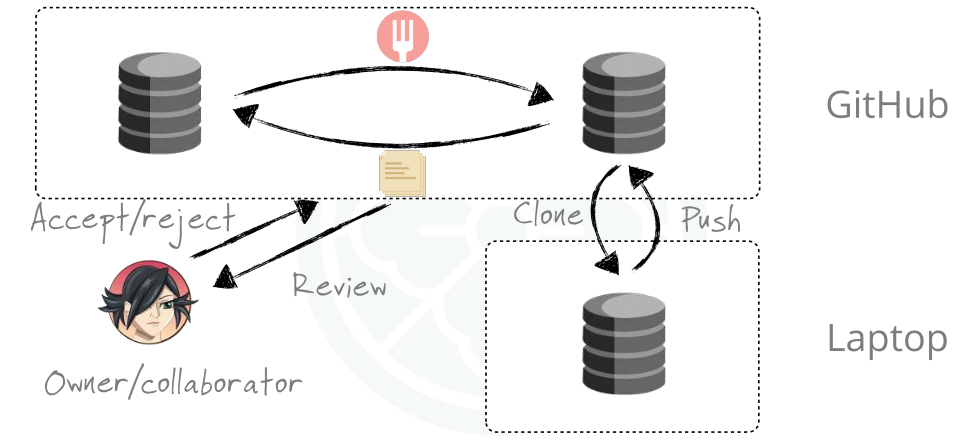
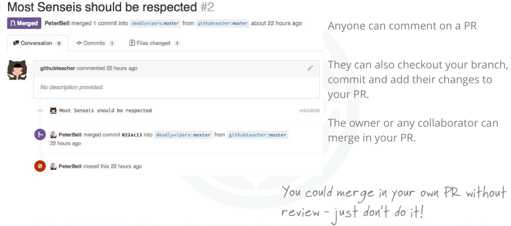
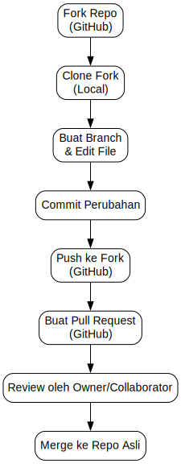

# Submitting a Pull Request (PR)

**Pull Request (PR)** adalah cara standar untuk **mengusulkan perubahan** ke sebuah repo di GitHub.  
Biasanya dipakai setelah Anda **fork repo**, melakukan perubahan, lalu ingin kontribusi balik ke repo asli.

---

## Alur Dasar Pull Request

1. **Fork & Clone** repo.

2. **Buat branch baru** untuk perubahan.

3. **Commit & push** branch ke repo fork Anda.

4. **Buka Pull Request** ke repo utama.

5. **Owner/collaborator** akan **review** lalu **merge/reject**.



## Membuat Pull Request

Setelah Anda push branch ke fork:

- Buka repo fork di GitHub.

- Klik tombol **“Compare & pull request”**.

- Tambahkan deskripsi perubahan Anda.

- Pilih target branch (biasanya `master` atau `main`) dari repo asli.

- Klik **“Create Pull Request”**.

**contoh alur lengkap**

```bash
git checkout -b fitur-baru

# edit file...
git add .
git commit -m "Tambah fitur baru"
git push origin fitur-baru

# lalu buka GitHub → buat PR
```

## Review Pull Request

- PR bisa dikomentari oleh siapa saja (kalau repo publik).

- Reviewer (owner/collaborator) bisa :
  - memberi komentar,
  - commit tambahan ke PR,
  - atau **merge**.



:::tip[Catatan]
Secara teknis, Anda **bisa merge PR Anda sendiri** (kalau punya akses write).  
Tapi **best practice**: **jangan merge sendiri → biarkan tim review dulu**.  
:::

## Ringkasan Alur PR

| Langkah     | Perintah/aksi                        | Keterangan                      |
| :---------- | :----------------------------------- | :------------------------------ |
| Buat branch | `git checkout -b fitur-xyz`          | Pisahkan perubahan              |
| Commit      | `git add . && git commit -m "Pesan"` | Simpan perubahan                |
| Push        | `git push origin fitur-xyz`          | Kirim ke fork                   |
| Buka PR     | via GitHub                           | Bandingkan → submit PR          |
| Review      | owner/collab cek                     | Bisa comment / request changes  |
| Merge       | via GitHub                           | PR diterima → masuk ke `master` |

Dengan PR, kontribusi menjadi **terkontrol**, ada ruang untuk diskusi, dan riwayat repo tetap rapi.

## Diagram Alur


