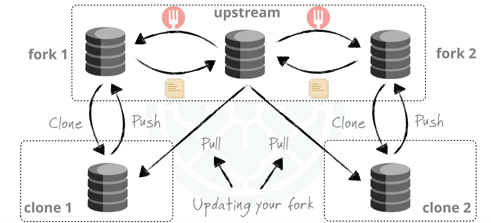

# Updating Your Fork

**Masalah umum**:

Setelah fork repo di GitHub, repo utama (_upstream_) mungkin terus berkembang (branch baru, bugfix, dll). Jika tidak di-update, fork Anda bisa tertinggal jauh.

**Solusinya:** tambahkan remote `upstream` (repo asli), lalu lakukan **fetch + merge/rebase**.

## Menambahkan Remote Upstream

**Tambahkan remote bernama "upstream" yang menunjuk ke repo asli**

```bash
git remote add upstream https://github.com/original/repo.git
```

**Cek daftar remote :**

```bash
git remote -v
```

**output :**

```plaintext
origin   https://github.com/username/repo-fork.git (fetch)
origin   https://github.com/username/repo-fork.git (push)
upstream https://github.com/original/repo.git (fetch)
upstream https://github.com/original/repo.git (push)
```

## Mengambil Perubahan dari Upstream

Ketik perintah berikut, untuk mengambil branch terbaru dari repo asli

```bash
git fetch upstream
```

## Menggabungkan Perubahan ke Master Lokal

Ada 2 pilihan :

### Merge

```bash
git checkout master
git merge upstream/master
```

### Rebase (riwayat lebih rapi)

```bash
git checkout master
git rebase upstream/master
```

## Mendorong Hasil Sinkronisasi ke Fork Anda

```bash
git push origin master
```

Dengan ini:

- Laptop Anda → **up-to-date** dengan repo utama.
- Fork Anda di GitHub → ikut ter-update.

## Ringkasan Alur

1. **Tambahkan remote upstream** → `git remote add upstream ...`

2. **Ambil update** dari repo asli → `git fetch upstream`

3. **Gabungkan ke master lokal** → `git merge upstream/master`

4. **Push ke fork** → `git push origin master`



## Contoh Workflow Lengkap

**Tambahkan upstream (sekali saja)**

```bash
git remote add upstream https://github.com/original/repo.git
```

**Update master lokal**

```bash
git fetch upstream
git checkout master
git merge upstream/master
```

**Dorong ke fork**

```bash
git push origin master
```
