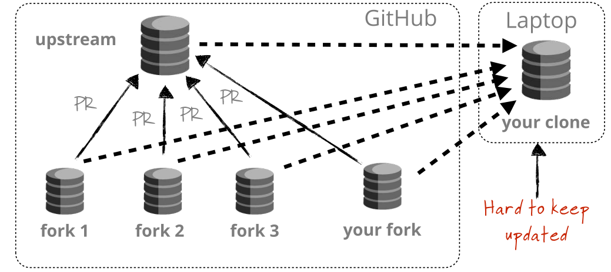
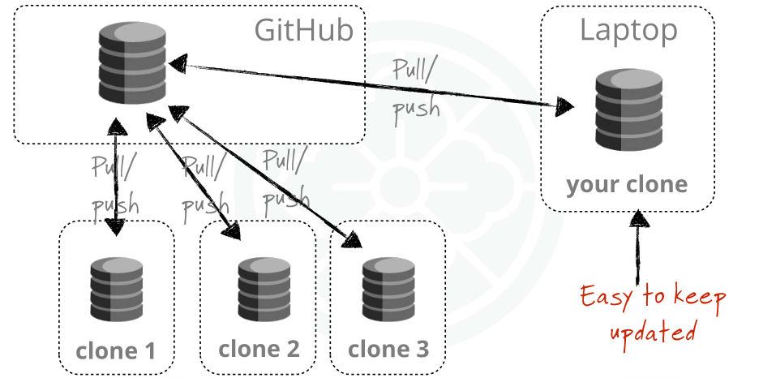
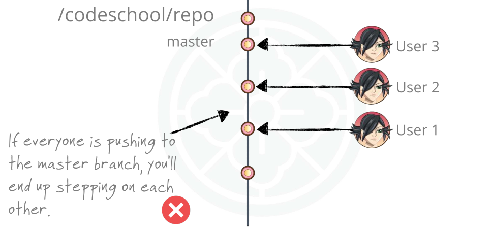
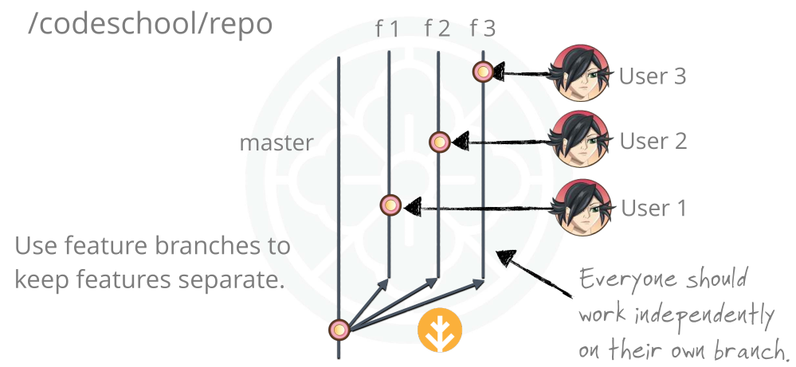
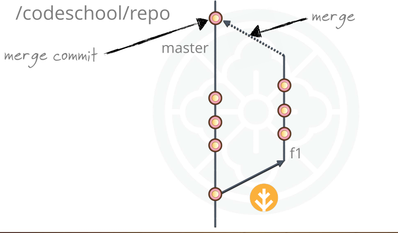

# Single Repository Workflow

Selain bekerja dengan **fork** (setiap orang punya salinan repo sendiri), ada cara lain yang sering dipakai:

**Semua orang bekerja pada satu repository yang sama di GitHub**.

## Perbedaan Fork-Based Workflow vs Single Repository Workflow

### Fork-Based Workflow

- Setiap developer punya **fork** sendiri.
- Semua perubahan lewat **Pull Request** ke repo utama.
- Kekurangannya: fork cepat tertinggal dari upstream, butuh sering sync.



### Single Repository Workflow

- Semua orang **clone repo yang sama**.
- Pull & push langsung ke repo utama.
- Lebih mudah menjaga repo tetap update.



## Masalah Jika Semua Commit Langsung ke Master

Kalau semua developer commit langsung ke `master` :

- Bisa terjadi konflik antar developer.
- Sulit melacak fitur baru.
- Riwayat commit menjadi berantakan.



## Solusi: Gunakan Feature Branch

:::tip[Best practice]
**Setiap developer bekerja di branch fitur masing-masing**.  
:::

### Buat branch baru untuk fitur

```bash
git checkout -b fitur-login
```

### Kerjakan perubahan

```bash
git add .
git commit -m "Tambah halaman login"
```

### Push ke remote

```bash
git push origin fitur-login
```

Dengan cara ini:

- Master tetap stabil.
- Fitur baru terisolasi.
- Bisa dibuat PR untuk review sebelum digabungkan.



## Kolaborasi di Feature Branch

Developer bisa juga **bekerja bersama di branch yang sama** jika sedang mengerjakan fitur besar.

### Ambil semua branch dari remote

```bash
git fetch
```

### Lihat semua branch (lokal + remote)

```
git branch -a
```

### Checkout branch tertentu

```bash
git checkout fitur-login
```

## Menggabungkan Kembali ke Master

Setelah fitur selesai dan direview, gabungkan ke master:

```bash
git checkout master
git merge fitur-login
```

Biasanya dilakukan melalui **Pull Request** di GitHub agar ada review.



## Ringkasan Single Repo Workflow

- Semua developer clone repo yang sama.
- Jangan langsung commit ke `master`.
- Buat **feature branch** untuk setiap fitur.
- Gunakan **Pull Request** agar perubahan di-review.

---

**Dengan workflow ini, tim bisa bekerja lebih rapi, konflik berkurang, dan riwayat proyek tetap terstruktur.**
