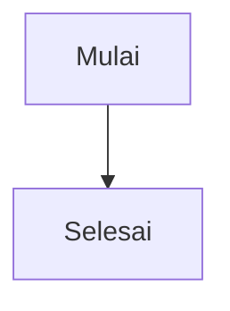

# Praktik Terbaik dalam Menggabungkan Pull Request

Saat menggabungkan kode ke cabang utama, ada beberapa hal yang perlu dipertimbangkan.

## 1. Rebase Interaktif untuk Menyederhanakan Riwayat (Simplify History)

Rebase interaktif (`git rebase -i`) adalah cara untuk membersihkan riwayat commit Anda sebelum digabungkan. Ini sangat berguna untuk menggabungkan beberapa commit kecil menjadi satu commit yang rapi (proses ini disebut **squashing**).

:::info[**Penting**]
Lakukan squashing hanya pada commit yang tidak lagi diperlukan atau yang masih dalam tahap pengerjaan.
:::

**Jangan pernah** melakukan squash pada seluruh cabang secara membabi buta, karena dapat menyulitkan anggota tim lain untuk melacak perubahan.

## 2. Rebase untuk Membuat Riwayat yang Linear

Jika tim Anda lebih menyukai riwayat Git yang lurus dan rapi tanpa banyak percabangan, Anda bisa menggunakan `git rebase`.

**Cara Kerjanya:** Rebase memindahkan commit dari cabang fitur Anda ke ujung cabang `master`, sehingga seolah-olah Anda mulai bekerja dari versi `master` yang paling baru.

- **Kelebihan:** Riwayat commit menjadi lebih sederhana, dan terlihat seperti fitur dikirim satu per satu.

- **Kekurangan:** Rebase akan mengubah "hash" commit, yang bisa membingungkan jika anggota tim lain sudah memiliki salinan cabang lama. Jadi, pastikan tim Anda sudah terbiasa dengan metode ini.

## 3. Fast-Forward atau Recursive Merge?

Saat menggabungkan (merge) cabang, Git memiliki dua strategi utama: `fast-forward` dan `recursive`.

### Fast-Forward Merge

Ini terjadi ketika cabang `master` tidak memiliki commit baru sejak Anda membuat cabang fitur. Git hanya akan memindahkan pointer `HEAD` ke commit terakhir di cabang fitur. Hasilnya adalah riwayat yang sangat linear tanpa commit "merge" baru.

### Recursive Merge

Ini terjadi ketika cabang `master` sudah memiliki commit baru. Git harus "menggabungkan" perubahan dari kedua cabang, dan ini akan menghasilkan **commit merge** baru. Anda bisa memaksakan merge ini dengan perintah `git merge --no-ff <nama_cabang_pr>`. Opsi `--no-ff` (no fast-forward) akan memastikan Git selalu membuat commit merge, meskipun fast-forward bisa dilakukan.

### Rekomendasi

`Recursive merge` biasanya lebih disukai karena menghasilkan riwayat yang jelas dan mudah dipahami. Commit merge yang dihasilkan berfungsi sebagai penanda yang jelas kapan sebuah fitur digabungkan.Jika Anda perlu kembali ke versi sebelumnya (revert), hanya ada satu commit yang perlu di-revert.

